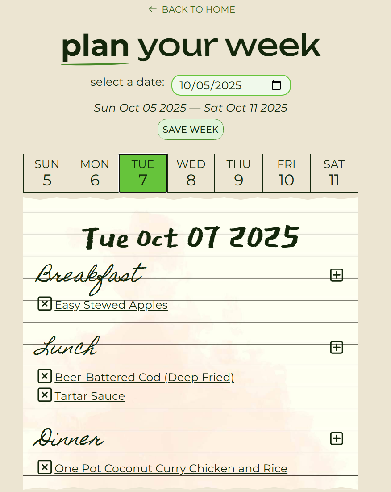

# EasyCook

EasyCook is a recipe and meal planning web app with a React + Vite frontend and Node.js backend, featuring Spoonacular API integration, authentication, and persistent meal storage.  
It helps users quickly find recipes, plan meals, manage pantry ingredients, and generate grocery lists, making weekly cooking easier and more organized.

---

## Demo and Visuals

[👉 **Click here to see live demo**](https://linettekuhn.github.io/easy-cook/)

  
  

---

## Features

- Recipe lookup using the Spoonacular API
- Create, manage, and save meal plans
- Store and manage pantry ingredients
- Automatic grocery list generation based on meal plans and pantry items
- User authentication for persistent data and multi-device access
- Responsive UI and UX for desktop and mobile viewing

---

## Built With

- Frontend: React, TypeScript
- Backend: Node.js, Express
- Deployment: Render, Github Pages
- Database: Firebase
- APIs: Spoonacular API

---
